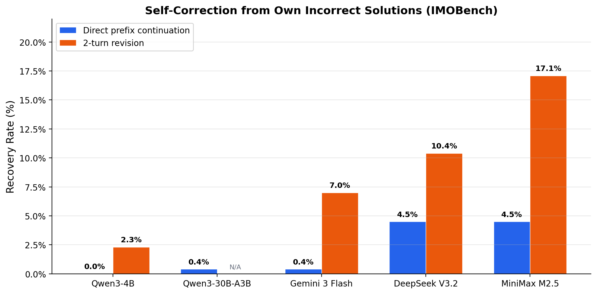
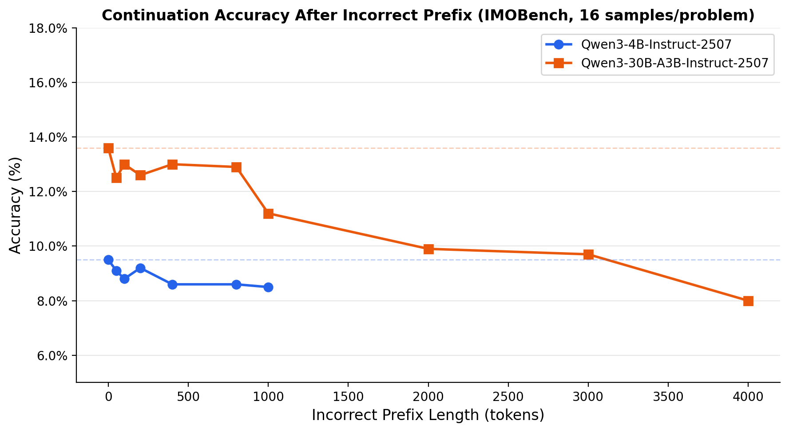
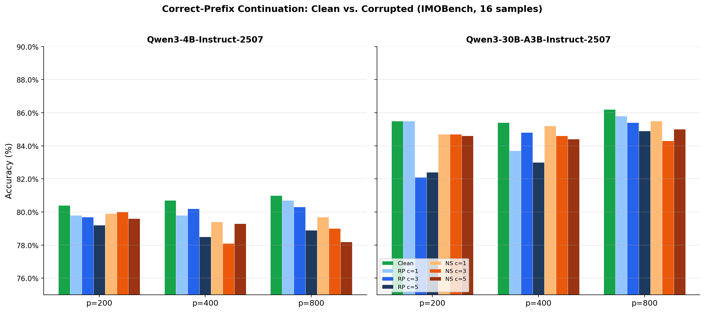
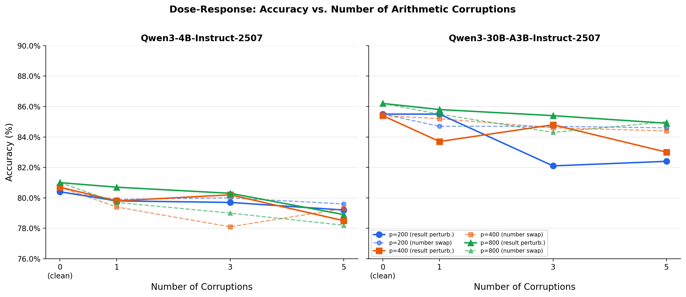
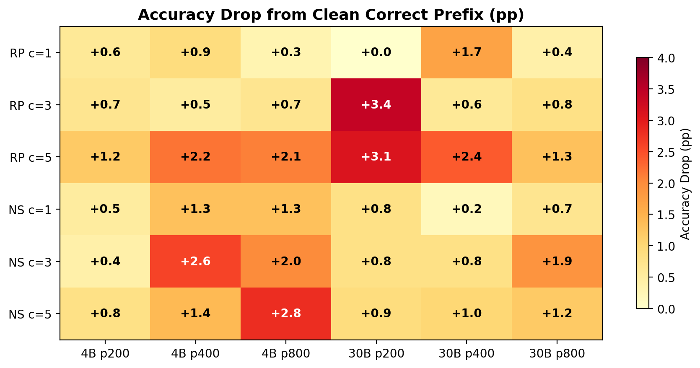

# Prefix Recovery & Synthetic Error Injection: Summary of Findings

**Date**: April 1, 2026
**Dataset**: IMOBench (343 competition math problems)
**Models**: Qwen3-4B-Instruct-2507, Qwen3-30B-A3B-Instruct-2507 (local vLLM), Gemini 3 Flash, DeepSeek V3.2, MiniMax M2.5 (API via OpenRouter)

## 1. Baseline Accuracy (IMOBench, single sample, temp=0.9)

| Model | Correct | Total | Accuracy |
|-------|---------|-------|----------|
| Qwen3-4B-Instruct-2507 | 125 | 400 | 31.2% |
| Qwen3-30B-A3B-Instruct-2507 | 145 | 400 | 36.2% |
| Gemini 3 Flash | 158 | 400 | 39.5% |
| DeepSeek V3.2 | 179 | 400 | 44.8% |
| MiniMax M2.5 | 75 | 400 | 18.8% |

---

## 2. Prefix Recovery: Can Models Self-Correct?

**Setup**: Feed each model its own incorrect baseline solution, test whether it recovers a correct answer. Two modes:
- **Direct continuation** (vLLM: extend the prefix; API: assistant-prefilled message)
- **2-turn revision** (API: user asks model to reconsider after seeing its wrong answer)

### Results

| Model | Incorrect Baselines | Direct Recovery | Rate | 2-Turn Recovery | Rate |
|-------|-------------------|-----------------|------|-----------------|------|
| Qwen3-4B-Instruct-2507 | 263 | 0 | **0.0%** | 6 | 2.3% |
| Qwen3-30B-A3B-Instruct-2507 | 228 | 1 | 0.4% | -- | -- |
| Gemini 3 Flash | 227 | 1 | 0.4% | 20 | 7.0% |
| DeepSeek V3.2 | 201 | 9 | 4.5% | 21 | 10.4% |
| MiniMax M2.5 | 336 | 15 | 4.5% | 53 | **17.1%** |

**Key findings**:
- Direct self-correction is near-zero for open-source models (0.0-0.4%) and weak even for the best API models (4.5%).
- 2-turn revision roughly doubles recovery rates, but still below 20% even for MiniMax M2.5.
- Models are strongly anchored to their own incorrect solutions. Once committed to a wrong reasoning path, they rarely escape.

---

## 3. Prefix Length Ablation: How Does Incorrect Prefix Length Affect Continuation?

**Setup**: Take each model's incorrect baseline solutions, truncate to varying prefix lengths (0-4000 tokens), generate 16 samples per problem, measure continuation accuracy.

### Qwen3-4B-Instruct-2507 (4,208 samples per length)

| Prefix Length | Correct | Accuracy |
|--------------|---------|----------|
| 0 (fresh) | 400 | 9.5% |
| 50 | 384 | 9.1% |
| 100 | 370 | 8.8% |
| 200 | 387 | 9.2% |
| 400 | 361 | 8.6% |
| 800 | 362 | 8.6% |
| 1000 | 359 | 8.5% |

### Qwen3-30B-A3B-Instruct-2507 (3,648 samples per length)

| Prefix Length | Correct | Accuracy |
|--------------|---------|----------|
| 0 (fresh) | 497 | 13.6% |
| 50 | 455 | 12.5% |
| 100 | 475 | 13.0% |
| 200 | 458 | 12.6% |
| 400 | 476 | 13.0% |
| 800 | 470 | 12.9% |
| 1000 | 410 | 11.2% |
| 2000 | 361 | 9.9% |
| 3000 | 355 | 9.7% |
| 4000 | 292 | 8.0% |

**Key findings**:
- Short incorrect prefixes (0-800 tokens) have minimal effect: accuracy is flat at ~9% (4B) and ~13% (30B).
- The model does not recover from wrong prefixes, but short wrong prefixes also don't make things worse (it's already just re-rolling).
- At extreme prefix lengths (2000-4000 tokens for 30B), accuracy degrades substantially (13.6% -> 8.0%). Longer wrong reasoning traps the model more deeply.

---

## 4. Synthetic Error Injection: Does Arithmetic Corruption Matter?

**Setup**: Take **correct** baseline solutions, truncate to prefix length p, optionally inject c arithmetic corruptions (result perturbation or number swap), generate 16 continuations, measure accuracy. Clean correct prefix = ceiling; corruption should degrade it.

### Clean Correct-Prefix Baselines

| Model | p=200 | p=400 | p=800 |
|-------|-------|-------|-------|
| Qwen3-4B | 80.4% | 80.7% | 81.0% |
| Qwen3-30B | 85.5% | 85.4% | 86.2% |

Models maintain high accuracy when continuing from their own correct prefixes (~80-86%).

### Corruption Results: Result Perturbation

| Condition | 4B p200 | 4B p400 | 4B p800 | 30B p200 | 30B p400 | 30B p800 |
|-----------|---------|---------|---------|----------|----------|----------|
| Clean | 80.4% | 80.7% | 81.0% | 85.5% | 85.4% | 86.2% |
| c=1 | 79.8% | 79.8% | 80.7% | 85.5% | 83.7% | 85.8% |
| c=3 | 79.7% | 80.2% | 80.3% | 82.1% | 84.8% | 85.4% |
| c=5 | 79.2% | 78.5% | 78.9% | 82.4% | 83.0% | 84.9% |

### Corruption Results: Number Swap

| Condition | 4B p200 | 4B p400 | 4B p800 | 30B p200 | 30B p400 | 30B p800 |
|-----------|---------|---------|---------|----------|----------|----------|
| Clean | 80.4% | 80.7% | 81.0% | 85.5% | 85.4% | 86.2% |
| c=1 | 79.9% | 79.4% | 79.7% | 84.7% | 85.2% | 85.5% |
| c=3 | 80.0% | 78.1% | 79.0% | 84.7% | 84.6% | 84.3% |
| c=5 | 79.6% | 79.3% | 78.2% | 84.6% | 84.4% | 85.0% |

### Accuracy Drop Summary (pp below clean baseline)

| Condition | 4B p200 | 4B p400 | 4B p800 | 30B p200 | 30B p400 | 30B p800 |
|-----------|---------|---------|---------|----------|----------|----------|
| RP c=1 | -0.6 | -0.9 | -0.3 | 0.0 | -1.7 | -0.4 |
| RP c=3 | -0.7 | -0.5 | -0.7 | **-3.4** | -0.6 | -0.8 |
| RP c=5 | -1.2 | **-2.2** | -2.1 | **-3.1** | **-2.4** | -1.3 |
| NS c=1 | -0.5 | -1.3 | -1.3 | -0.8 | -0.2 | -0.7 |
| NS c=3 | -0.4 | **-2.6** | -2.0 | -0.8 | -0.8 | -1.9 |
| NS c=5 | -0.8 | -1.4 | **-2.8** | -0.9 | -1.0 | -1.2 |

**Key findings**:

1. **Small but consistent degradation**: Corruption reduces accuracy by 0.3-3.4 pp, with the largest drops at c=5 (heavy corruption).

2. **No catastrophic failure**: Even 5 arithmetic errors in the prefix only cause a ~2-3 pp accuracy drop. Models substantially "route around" corrupted arithmetic rather than blindly propagating errors.

3. **Result perturbation slightly worse than number swap**: RP produces the largest single drop (3.4 pp at 30B p200 c=3), while NS effects are more diffuse. This suggests models are somewhat sensitive to incorrect arithmetic results, but not dramatically so.

4. **No clear dose-response**: The relationship between number of corruptions and accuracy loss is noisy rather than monotonic. c=3 sometimes hurts more than c=5. This suggests stochastic rather than systematic sensitivity.

5. **No strong prefix-length interaction**: Corruption effects don't consistently increase with prefix length. Errors at p200 are roughly as damaging as at p800.

6. **Model size doesn't clearly help**: 30B shows the largest single drop (3.4 pp at p200 RP c=3), while 4B's worst is 2.8 pp. Larger models aren't obviously more robust to arithmetic corruption.

---

## 5. Overall Interpretation

### Models don't use their reasoning traces as active computation

The corruption experiments show that models **largely ignore** injected arithmetic errors:
- Clean correct prefixes yield ~80-86% accuracy
- 5 corrupted arithmetic results in the prefix only drops accuracy to ~78-84%
- The model re-derives or pattern-matches rather than chaining from intermediate results

This is consistent with prior findings (Lanham et al., 2023) that CoT may function more as "post-hoc rationalization" than genuine step-by-step computation, at least for these smaller models on competition math.

### Self-correction is near-impossible without external signal

The prefix recovery results show models are strongly anchored to wrong reasoning paths:
- Direct continuation recovery: 0-4.5%
- Even with an explicit "try again" turn: 2.3-17.1%
- The best recovery comes from MiniMax M2.5, which also has the lowest baseline accuracy (18.8%)

This has practical implications: **iterative refinement without external verification feedback is unlikely to improve accuracy**, because models cannot reliably detect and correct their own errors.

### Incorrect prefix length has a threshold effect

Short incorrect prefixes (< 1000 tokens) don't significantly reduce accuracy below fresh generation — the model effectively "restarts" its reasoning. But very long incorrect prefixes (2000-4000 tokens) substantially degrade performance, suggesting the model becomes increasingly committed to the wrong reasoning path as the prefix grows.

---

## 6. Figures

All figures saved in `figures/`:
- `recovery_vs_revision.png` — Recovery rates: direct vs 2-turn revision
- `prefix_length_ablation.png` — Accuracy vs incorrect prefix length
- `corruption_grouped_bars.png` — Clean vs corrupted accuracy by model and prefix length
- `corruption_dose_response.png` — Accuracy vs number of corruptions
- `corruption_drop_heatmap.png` — Accuracy drop heatmap across all conditions
